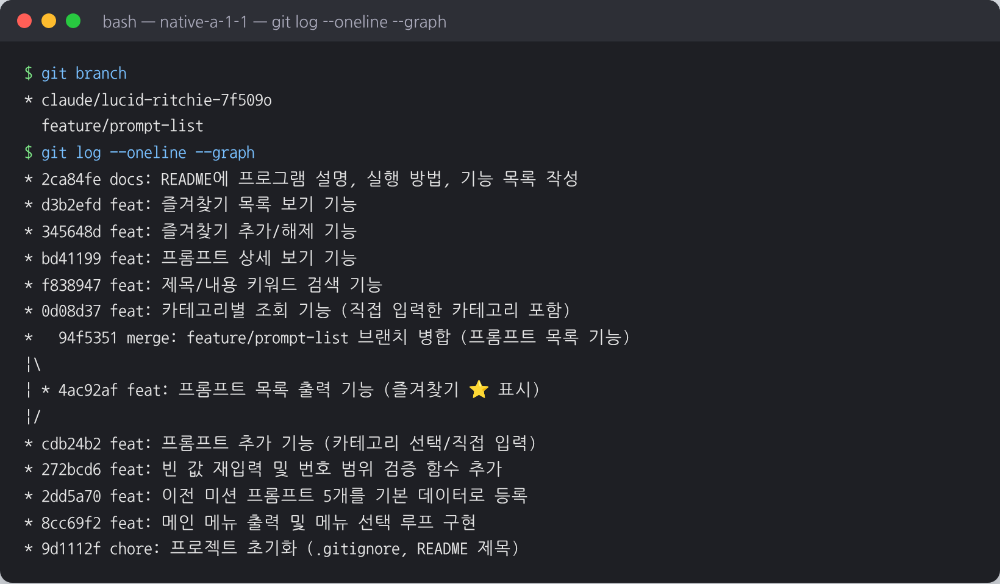

# 나만의 프롬프트 관리 프로그램

GenAI 미션을 진행하며 쌓인 프롬프트(텍스트·이미지·영상 생성, 페르소나, 자동화 등)를
한 곳에서 **분류·검색·즐겨찾기**로 관리하는 Python 콘솔 프로그램입니다.

- 외부 라이브러리 없이 Python 기본 문법(리스트, 딕셔너리, 함수, 조건문, 반복문)만 사용합니다.
- 데이터는 프로그램 실행 중에만 유지되며, 종료하면 기본 데이터로 초기화됩니다.

## 실행 방법

Python 3.10 이상이 필요합니다.

```bash
# 1. 저장소 내려받기
git clone https://github.com/sungmin-maker/native-a-1-1.git
cd native-a-1-1

# 2. 버전 확인
python3 --version      # Windows: python --version

# 3. 실행
python3 main.py        # Windows: python main.py
```

실행하면 메뉴가 나오고, 번호를 입력해 기능을 선택합니다.

```
=== 나만의 프롬프트 관리 ===
1. 프롬프트 추가
2. 프롬프트 목록
3. 카테고리별 조회
4. 프롬프트 검색
5. 프롬프트 상세 보기
6. 즐겨찾기 관리
7. 즐겨찾기 목록
0. 종료
선택:
```

## 기능 목록

| 번호 | 기능 | 설명 |
|---|---|---|
| 1 | 프롬프트 추가 | 제목·내용·카테고리를 입력해 등록합니다. 빈 값은 다시 입력받고, 카테고리는 목록에서 고르거나 직접 입력합니다. 즐겨찾기 기본값은 해제 상태입니다. |
| 2 | 프롬프트 목록 | 전체 프롬프트를 `번호. [카테고리] 제목 ⭐` 형식으로 보여줍니다. |
| 3 | 카테고리별 조회 | 카테고리를 선택하면 해당 카테고리의 프롬프트만 보여줍니다. 직접 입력한 카테고리도 목록에 나타납니다. |
| 4 | 프롬프트 검색 | 키워드가 제목 또는 내용에 포함된 프롬프트를 찾습니다 (영문 대소문자 무시). |
| 5 | 프롬프트 상세 보기 | 번호를 입력하면 제목, 카테고리, 즐겨찾기 여부, 내용 전체를 보여줍니다. |
| 6 | 즐겨찾기 관리 | 번호를 입력해 즐겨찾기를 추가하거나 해제합니다 (토글). |
| 7 | 즐겨찾기 목록 | 즐겨찾기한 프롬프트만 모아서 보여줍니다. |
| 0 | 종료 | 프로그램을 종료합니다. |

- 잘못된 메뉴 번호, 숫자가 아닌 입력, 범위를 벗어난 번호에는 안내 메시지를 출력합니다.
- 조회·검색·즐겨찾기 결과에 보이는 번호는 **전체 목록 기준 번호**라서, 그대로 상세 보기나 즐겨찾기 관리에 입력할 수 있습니다.

## 프롬프트 카테고리

| 카테고리 | 설명 | 기본 등록 프롬프트 |
|---|---|---|
| 텍스트 생성 | 글쓰기, 요약, 이메일 등 텍스트 결과물을 만드는 프롬프트 | 블로그 글 작성 도우미 ⭐ |
| 이미지 생성 | 이미지 생성 AI에 넣는 장면·스타일 묘사 프롬프트 | 제품 썸네일 생성 |
| 영상 생성 | 영상 스크립트, 장면 구성 프롬프트 | 30초 광고 영상 스크립트 |
| 페르소나 | AI에게 역할과 말투를 부여하는 프롬프트 | IT 컨설턴트 페르소나 |
| 자동화 | 노코드 자동화 흐름 안에서 반복 실행하는 프롬프트 | 뉴스 요약 자동화 ⭐ |
| 기타 | 위 분류에 속하지 않는 프롬프트 | - |

추가할 때 "직접 입력"을 고르면 새 카테고리를 만들 수 있습니다.

## 코드 구조

모든 코드는 `main.py` 한 파일에 있고, 기능별로 함수가 나뉘어 있습니다.

| 함수 | 역할 |
|---|---|
| `show_menu()` | 메뉴 출력 |
| `add_prompt()` | 프롬프트 추가 |
| `show_list()` | 전체 목록 |
| `show_by_category()` | 카테고리별 조회 |
| `search_prompt()` | 키워드 검색 |
| `show_detail()` | 상세 보기 |
| `toggle_favorite()` | 즐겨찾기 추가/해제 |
| `show_favorites()` | 즐겨찾기 목록 |
| `input_non_empty()`, `input_number()`, `choose_category()`, `select_prompt()` | 입력 검증 도우미 |
| `find_prompts()`, `print_matches()`, `print_prompt_line()` | 조회 결과 출력 도우미 |

데이터는 아래와 같은 딕셔너리의 리스트로 저장합니다.

```python
prompts = [
    {
        "title": "블로그 글 작성 도우미",
        "content": "당신은 10년 경력의 전문 블로거입니다...",
        "category": "텍스트 생성",
        "favorite": True,
    },
]
```

## 실행 화면

| 화면 | 파일 |
|---|---|
| 개발 환경 확인 (Python/Git 버전, Git 설정, Hello 실행) | [01_env.png](docs/screenshots/01_env.png) |
| 프롬프트 추가 | [02_add.png](docs/screenshots/02_add.png) |
| 잘못된 메뉴 입력, 목록, 카테고리별 조회 | [03_list_category.png](docs/screenshots/03_list_category.png) |
| 검색, 상세 보기 | [04_search_detail.png](docs/screenshots/04_search_detail.png) |
| 즐겨찾기 추가/해제, 즐겨찾기 목록 | [05_favorites.png](docs/screenshots/05_favorites.png) |
| `git log --oneline --graph` | [06_git_log.png](docs/screenshots/06_git_log.png) |
| 공개 샘플 저장소 clone | [07_clone.png](docs/screenshots/07_clone.png) |


